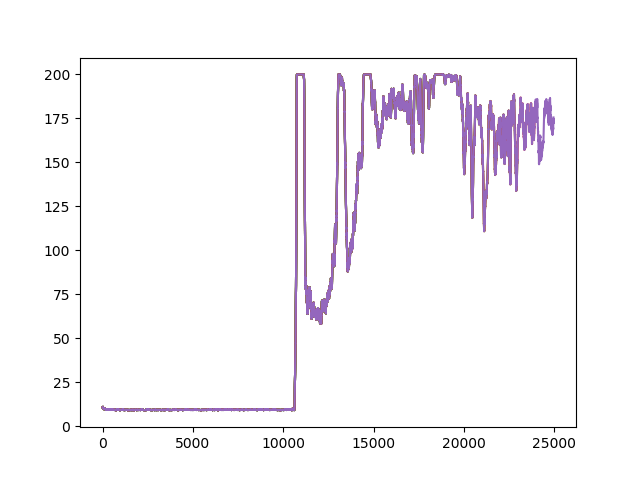

# World Models implementation
This repository contains the code for a simplified implementation of ["World Models" paper](https://arxiv.org/abs/1803.10122), [(NeurIPS version)](https://arxiv.org/abs/1809.01999) , where the controller is trained with A2C. 
Note that since we train both M and C together, we stopped gradients of the controller from flowing in to the world model, to allow for learning  task independent features.
Also the encoder is a simple fully connected network and will be converted into VAE and the model is currently a RNN with fully connected network, instead of mixture density network.

## Results
Results of this implementation on [CartPole-v0](https://gym.openai.com/envs/CartPole-v0/) Open AI Gym environment. More results to follow.

